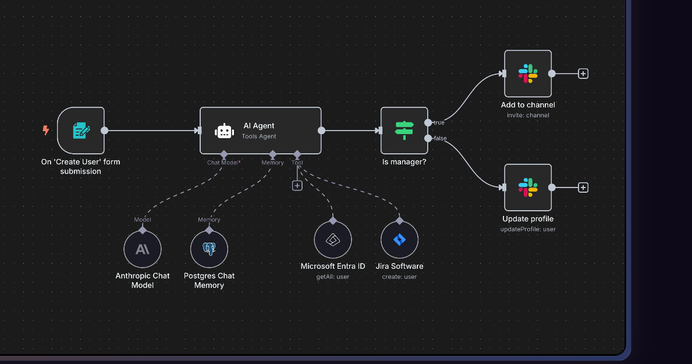
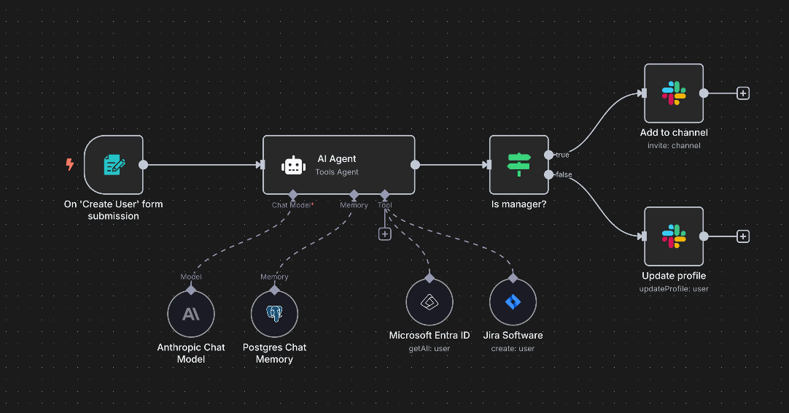
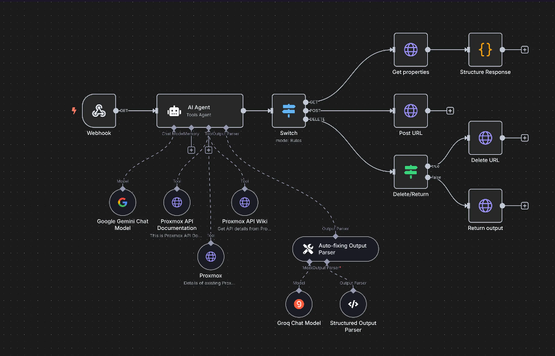
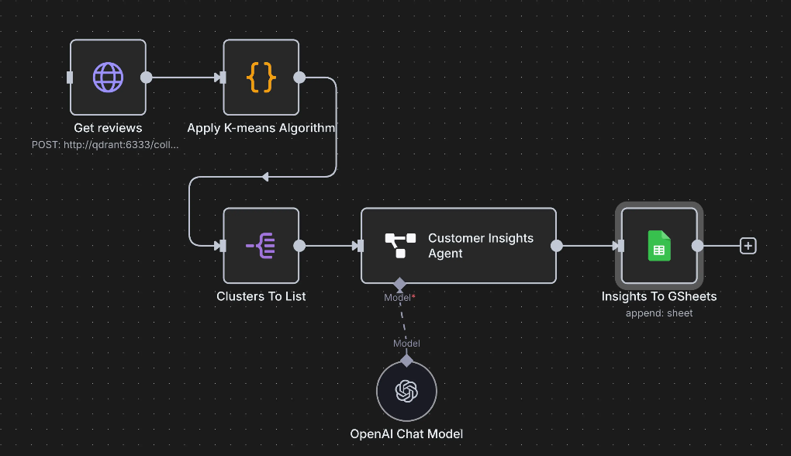

# Deploy n8n Workflow Automation on AWS EKS - Production Ready in Any Region

[](https://opensource.org/licenses/MIT)
[](https://aws.amazon.com/eks/)
[](https://n8n.io/)
[](https://www.postgresql.org/)

**One-click deployment of n8n workflow automation platform on Amazon EKS with enterprise-grade security, multi-region support, and production-ready configuration. Perfect for DevOps teams looking to automate workflows at scale.**

## What's New in v2.0

**Major Code Quality Improvements:**
- All scripts now include comprehensive error handling and validation
- New shared functions library (`common.sh`) for consistency
- Prerequisites checking (aws, kubectl, eksctl) before operations
- AWS credentials and region validation
- Color-coded output for better visibility
- Help documentation for all scripts (`--help` flag)
- Security improvements: credentials retrieved from Kubernetes secrets

**Enhanced Scripts:**
- **Backup**: Retention policy, automatic cleanup, backup validation
- **Restore**: Pre-restore safety backup, rollback on failure
- **Monitor**: Watch mode for continuous monitoring
- **Logs**: Follow mode, multi-service support, configurable output
- **Cleanup**: Namespace-only mode, orphaned resource detection
- **Deploy**: Full validation pipeline, manifest verification
- **Cost-Optimized**: Secure credential handling, auto-config generation

---

## Architecture Overview

Deploying n8n on Amazon EKS provides scalability, automation, and high reliability for enterprise workflow operations.

### Overall Architecture

**Amazon EKS** - Container orchestration platform that manages and scales n8n applications with high availability and security.

**Amazon EC2 (Worker Nodes)** - Runs n8n and PostgreSQL pods in isolated environments with dedicated compute resources.

**PostgreSQL** - Stores workflow data, credentials, and execution history with persistent storage and backup capabilities.

**AWS Load Balancer Controller** - Provides n8n access endpoints via Network Load Balancer for high performance and low latency.

**Amazon CloudWatch** - Collects logs and metrics for comprehensive monitoring, alerting, and performance optimization.

**Amazon S3 (Optional)** - Stores automated backups and workflow exports for disaster recovery and compliance.

### Operational Flow

```
Internet → AWS NLB → EKS Service → n8n Pod → PostgreSQL Pod
                                      ↓
                              CloudWatch Logs/Metrics
                                      ↓
                              S3 Backup (Optional)
```

1. **User Access** - Users access n8n interface through Load Balancer URL or custom domain (HTTPS can be configured separately).

2. **Request Processing** - Requests are routed to n8n application pods within the dedicated n8n namespace.

3. **Data Persistence** - Workflow runtime interacts with PostgreSQL for data storage and retrieval operations.

4. **Monitoring** - All metrics and logs are exported to CloudWatch for real-time monitoring and optimization.

5. **Backup Operations** - Automated CronJob backups send data to S3 for disaster recovery (when configured).

### Architecture Benefits

- **Multi-Region Ready** - Easy expansion across multiple AWS regions with consistent deployment patterns.
- **Security by Design** - NetworkPolicy isolation, HTTPS encryption, and separate IAM roles for enhanced security.
- **Observability** - Integrated metrics, logs, and events with CloudWatch for comprehensive monitoring.
- **Scalability** - Supports horizontal pod autoscaling based on CPU/memory load with automatic resource management.
- **High Availability** - Multi-AZ deployment with pod anti-affinity for fault tolerance and zero-downtime operations.
- **Cost Optimization** - Resource quotas and limits prevent over-provisioning while maintaining performance.

---

## What is n8n?

**n8n** (pronounced "n-eight-n") is a powerful, open-source workflow automation tool that enables you to connect different services and automate repetitive tasks without writing code. It's designed for technical and non-technical users alike.

### Key Features

- **Visual Workflow Builder** - Drag-and-drop interface for creating complex automation workflows
- **400+ Integrations** - Pre-built nodes for popular services (Slack, Gmail, AWS, GitHub, etc.)
- **Code Flexibility** - Execute custom JavaScript, Python, or shell commands when needed
- **Self-Hosted** - Full control over your data and workflows
- **API-First** - RESTful API for programmatic workflow management
- **Conditional Logic** - Advanced branching, loops, and error handling
- **Scheduling** - Time-based triggers and cron job support
- **Webhook Support** - HTTP endpoints for external service integration

### Use Cases

**IT Ops can**
⚡ On-board new employees



**Sec Ops can**
⚡ Enrich security incident tickets



**Dev Ops can**
⚡ Convert natural language into API calls



**Sales can**
⚡ Generate customer insights from reviews



---

## Project Structure

```
n8n-on-aws-eks/
├── infrastructure/
│   ├── cluster-config.yaml              # EKS cluster configuration template
│   └── cost-optimized-cluster.yaml      # Cost-optimized cluster config (auto-generated)
├── manifests/                            # Kubernetes manifests
│   ├── 00-namespace.yaml                 # Namespace & resource quotas
│   ├── 01-postgres-secret.yaml           # Database credentials
│   ├── 02-persistent-volumes.yaml        # PVC definitions
│   ├── 03-postgres-deployment.yaml       # PostgreSQL deployment
│   ├── 04-postgres-service.yaml          # PostgreSQL service
│   ├── 05-network-policy.yaml            # Network security policies
│   ├── 06-n8n-deployment.yaml            # n8n application deployment
│   ├── 07-n8n-service.yaml               # n8n LoadBalancer service
│   ├── 08-hpa.yaml                       # Horizontal Pod Autoscaler
│   ├── 09-ingress.yaml                   # Ingress configuration
│   ├── 10-backup-cronjob.yaml            # Automated backup jobs
│   └── 11-restore-job.yaml               # Restore job template
├── scripts/
│   ├── common.sh                         # Shared functions library
│   ├── deploy.sh                         # Production deployment with validation
│   ├── deploy-cost-optimized.sh          # Cost-optimized deployment (spot instances)
│   ├── monitor.sh                        # Real-time monitoring dashboard
│   ├── backup.sh                         # Database backup with retention
│   ├── restore.sh                        # Database restore with pre-backup
│   ├── get-logs.sh                       # Log retrieval with follow mode
│   └── cleanup.sh                        # Resource cleanup (namespace/full)
├── backups/                              # Backup storage directory (auto-created)
├── images/                               # Documentation screenshots
│   ├── n8n-setup.png                     # Setup interface
│   ├── n8n-workflow.png                  # Workflow builder
│   ├── n8n-workflow-example.png          # Advanced workflow example
│   ├── it-ops-onboarding.png             # IT ops use case
│   ├── sec-ops-incident-enrichment.png   # Security ops use case
│   ├── dev-ops-natural-language-api.png  # DevOps use case
│   └── sales-customer-insights.png       # Sales use case
├── LICENSE                               # MIT License
└── README.md                             # This file
```

---

## Scripts Overview

All scripts have been enhanced with enterprise-grade features including comprehensive validation, error handling, and help documentation.

### Core Features (New in v2.0)

- **Strict Mode**: All scripts use `set -euo pipefail` for safer execution
- **Prerequisites Validation**: Automatic checking for required commands (aws, kubectl, eksctl)
- **AWS Validation**: Credentials and region verification before operations
- **Help Documentation**: Every script supports `--help` flag with examples
- **Shared Library**: Common functions in `scripts/common.sh` for consistency
- **Color-Coded Output**: Clear visual feedback (info, success, warning, error)
- **Secure Credentials**: Database credentials retrieved from Kubernetes secrets

### Script Descriptions

| Script | Purpose | Key Features |
|--------|---------|--------------|
| **deploy.sh** | Production EKS deployment | Prerequisites check, region validation, manifest verification |
| **deploy-cost-optimized.sh** | Cost-optimized deployment | Spot instances, minimal resources, auto-config generation |
| **monitor.sh** | Status monitoring | Watch mode, real-time updates, resource usage tracking |
| **backup.sh** | Database backup | Retention policy, automatic cleanup, backup validation |
| **restore.sh** | Database restore | Pre-restore backup, safety checks, rollback on failure |
| **get-logs.sh** | Log retrieval | Follow mode, multi-service support, configurable output |
| **cleanup.sh** | Resource cleanup | Namespace-only mode, orphaned resource detection |
| **common.sh** | Shared library | Logging, validation, error handling functions |

### Quick Help

All scripts support the `--help` flag for detailed usage information:

```bash
./scripts/deploy.sh --help
./scripts/backup.sh --help
./scripts/restore.sh --help
./scripts/get-logs.sh --help
./scripts/monitor.sh --help
./scripts/cleanup.sh --help
./scripts/deploy-cost-optimized.sh --help
```

---

## Quick Start

### Prerequisites

Before deploying n8n on EKS, ensure you have:

- **AWS CLI** configured with appropriate profile and permissions
- **kubectl** installed (v1.28+)
- **eksctl** installed (v0.150+)
- **Minimum AWS Permissions**:
  - EKS cluster creation and management
  - EC2 instance management
  - VPC and networking resources
  - IAM role creation
  - CloudFormation stack management

### 1. Deploy to Any Region

All scripts now include comprehensive validation, error handling, and help messages.

```bash
# Clone this repository
git clone https://github.com/vanhoangkha/n8n-on-aws-eks.git
cd n8n-on-aws-eks

# View deployment options
./scripts/deploy.sh --help

# Deploy to default region (us-east-1) - with automatic validation
./scripts/deploy.sh

# Deploy to specific region
REGION=us-west-2 ./scripts/deploy.sh

# Deploy with custom cluster name and region
CLUSTER_NAME=my-n8n-cluster REGION=eu-west-1 ./scripts/deploy.sh

# Deploy with custom AWS profile
AWS_PROFILE=myprofile REGION=ap-southeast-1 ./scripts/deploy.sh

# All parameters together
CLUSTER_NAME=production-n8n REGION=us-west-2 AWS_PROFILE=devops ./scripts/deploy.sh
```

**New in v2.0:**
- Automatic prerequisite checking (aws, kubectl, eksctl)
- AWS credentials and region validation
- Cluster existence verification
- Manifest file validation before deployment
- Better error messages and logging

### 2. Monitor Deployment Status

```bash
# One-time status check
./scripts/monitor.sh

# Continuous monitoring (refreshes every 5 seconds)
./scripts/monitor.sh --watch

# Custom refresh interval (every 10 seconds)
./scripts/monitor.sh -w -i 10

# View help
./scripts/monitor.sh --help
```

**Features:**
- Real-time pod status and resource usage
- Service endpoints and LoadBalancer URLs
- Recent events and alerts
- Quick command reference

### 3. Access n8n

```bash
# Get LoadBalancer URL (shown in deployment output)
kubectl get service n8n-service-simple -n n8n

# Or use monitor script for full status
./scripts/monitor.sh
```


*n8n owner account setup interface - Configure your admin credentials to get started*

---

## Regional Deployment Examples

### North America
```bash
# US East (Virginia)
REGION=us-east-1 ./scripts/deploy.sh

# US West (Oregon)
REGION=us-west-2 ./scripts/deploy.sh

# Canada (Central)
REGION=ca-central-1 ./scripts/deploy.sh
```

### Europe
```bash
# Europe (Ireland)
REGION=eu-west-1 ./scripts/deploy.sh

# Europe (Frankfurt)
REGION=eu-central-1 ./scripts/deploy.sh

# Europe (London)
REGION=eu-west-2 ./scripts/deploy.sh
```

### Asia Pacific
```bash
# Asia Pacific (Tokyo)
REGION=ap-northeast-1 ./scripts/deploy.sh

# Asia Pacific (Singapore)
REGION=ap-southeast-1 ./scripts/deploy.sh

# Asia Pacific (Sydney)
REGION=ap-southeast-2 ./scripts/deploy.sh
```

---

## Initial Setup & Configuration

### Step 1: Owner Account Setup

When you first access n8n, you'll be prompted to create an owner account:

1. **Email** - Your admin email address
2. **First Name** - Your first name
3. **Last Name** - Your last name  
4. **Password** - Strong password (8+ characters, 1 number, 1 capital letter)

### Step 2: Workspace Configuration

After account creation, configure your workspace:

1. **Workspace Name** - Choose a descriptive name for your organization
2. **Usage Plan** - Select based on your automation needs
3. **Team Setup** - Invite team members (optional)

### Step 3: First Workflow

Create your first automation workflow:

1. Click **"Create new workflow"**
2. Add a **Trigger Node** (Manual, Webhook, Schedule, etc.)
3. Add **Action Nodes** (HTTP Request, Email, Database, etc.)
4. **Connect nodes** by dragging between connection points
5. **Configure each node** with required parameters
6. **Test workflow** using the "Execute Workflow" button
7. **Save and activate** your workflow


*n8n workflow builder interface - Visual drag-and-drop workflow creation with multiple nodes and connections*

### Advanced Workflow Example


*Example of a more complex n8n workflow with multiple integrations, conditional logic, and data processing nodes*

### Step 4: Security Configuration

Enhance security for production use:

```bash
# Enable HTTPS (recommended for production)
kubectl patch deployment n8n-simple -n n8n -p '{"spec":{"template":{"spec":{"containers":[{"name":"n8n","env":[{"name":"N8N_SECURE_COOKIE","value":"true"},{"name":"N8N_PROTOCOL","value":"https"}]}]}}}}'

# Set up custom domain (requires certificate)
# Update service to use custom domain and TLS
```

---

## Configuration

### Database Configuration
- **Host**: postgres-service-simple.n8n.svc.cluster.local
- **Database**: n8n
- **User**: n8nuser
- **Password**: n8n-secure-password-2024
- **Port**: 5432

### Resource Allocation

| Component | CPU Request | CPU Limit | Memory Request | Memory Limit | Storage |
|-----------|-------------|-----------|----------------|--------------|---------|
| PostgreSQL | 250m | 500m | 256Mi | 512Mi | 20Gi (emptyDir) |
| n8n | 250m | 1000m | 512Mi | 1Gi | 10Gi (emptyDir) |

### Environment Variables

| Variable | Value | Description |
|----------|-------|-------------|
| `N8N_SECURE_COOKIE` | false | Cookie security (set to true for HTTPS) |
| `N8N_PROTOCOL` | http | Protocol (change to https for production) |
| `N8N_PORT` | 5678 | Application port |
| `N8N_METRICS` | true | Enable Prometheus metrics |
| `DB_TYPE` | postgresdb | Database type |
| `DB_POSTGRESDB_HOST` | postgres-service-simple.n8n.svc.cluster.local | Database host |
| `DB_POSTGRESDB_DATABASE` | n8n | Database name |

---

## Management Commands

### Monitoring and Logs

```bash
# Real-time monitoring dashboard
./scripts/monitor.sh

# Continuous monitoring (auto-refresh)
./scripts/monitor.sh --watch

# View n8n logs (last 100 lines)
./scripts/get-logs.sh n8n

# Follow n8n logs in real-time
./scripts/get-logs.sh n8n --follow

# View PostgreSQL logs
./scripts/get-logs.sh postgres -n 50

# View all service logs
./scripts/get-logs.sh all --lines 200
```

**Log Script Features:**
- Follow mode for real-time log streaming
- Support for n8n, postgres, or all services
- Configurable line count
- All-pods mode for multi-replica deployments

### Database Backup and Restore

```bash
# Create database backup (with automatic retention)
./scripts/backup.sh

# Create backup in custom directory
./scripts/backup.sh /path/to/backups

# Create backup with custom retention (14 days)
./scripts/backup.sh ./backups 14

# Restore from backup (with automatic pre-restore backup)
./scripts/restore.sh backups/n8n-backup-20241201-120000.sql.gz

# Restore without creating pre-restore backup (not recommended)
./scripts/restore.sh backups/n8n-backup.sql.gz --skip-backup

# View backup script options
./scripts/backup.sh --help
./scripts/restore.sh --help
```

**Backup Features:**
- Automatic backup directory creation
- Configurable retention policy (default: 7 days)
- Old backup cleanup
- Backup validation (size and integrity)
- Pre-restore safety backup
- Secure credential handling from Kubernetes secrets

### Cluster Operations

```bash
# Check cluster status
kubectl cluster-info
kubectl get nodes

# Check n8n namespace resources
kubectl get all -n n8n

# View resource usage
kubectl top pods -n n8n
kubectl top nodes
```

### Application Management

```bash
# Scale application
kubectl scale deployment n8n-simple --replicas=3 -n n8n

# Update n8n version
kubectl set image deployment/n8n-simple n8n=n8nio/n8n:1.0.0 -n n8n

# Restart deployment
kubectl rollout restart deployment/n8n-simple -n n8n
```

### Manual Database Operations

```bash
# Connect to PostgreSQL (for manual operations)
kubectl exec -it deployment/postgres-simple -n n8n -- psql -U n8nuser -d n8n

# Manual backup (use backup.sh script instead)
kubectl exec deployment/postgres-simple -n n8n -- pg_dump -U n8nuser n8n > n8n-backup-$(date +%Y%m%d).sql

# Manual restore (use restore.sh script instead)
kubectl exec -i deployment/postgres-simple -n n8n -- psql -U n8nuser -d n8n < n8n-backup.sql
```

---

## Security & Best Practices

### Production Security Checklist

- [ ] Enable HTTPS/TLS with valid certificates
- [ ] Use strong, unique passwords for all accounts
- [ ] Implement network policies for pod-to-pod communication
- [ ] Enable audit logging for compliance
- [ ] Regular security updates and patches
- [ ] Backup strategy implementation
- [ ] Monitor resource usage and set alerts

### Network Security

```bash
# Apply network policies (example)
kubectl apply -f - <<EOF
apiVersion: networking.k8s.io/v1
kind: NetworkPolicy
metadata:
  name: n8n-network-policy
  namespace: n8n
spec:
  podSelector:
    matchLabels:
      app: n8n-simple
  policyTypes:
  - Ingress
  - Egress
  ingress:
  - from: []
    ports:
    - protocol: TCP
      port: 5678
EOF
```

---

## Monitoring & Observability

### Health Checks

The deployment includes comprehensive health monitoring:

- **Liveness Probe** - HTTP GET `/healthz` every 30s
- **Readiness Probe** - HTTP GET `/healthz` every 10s
- **Startup Probe** - HTTP GET `/healthz` with 60s timeout

### Metrics Collection

```bash
# Enable metrics collection
kubectl port-forward service/n8n-service-simple 8080:80 -n n8n

# Access metrics endpoint
curl http://localhost:8080/metrics
```

### Log Aggregation

```bash
# Stream logs from all n8n pods
kubectl logs -f -l app=n8n-simple -n n8n

# Export logs to file
kubectl logs deployment/n8n-simple -n n8n > n8n-logs-$(date +%Y%m%d).log
```

---

## Cost Calculation

### Monthly Cost Breakdown by Region

#### US East (us-east-1) - Lowest Cost
| Component | Standard | Cost-Optimized |
|-----------|----------|----------------|
| EKS Control Plane | $73.00 | $73.00 |
| EC2 (t3.medium × 2) | $58.40 | - |
| EC2 (t3.small × 1 Spot) | - | $8.76 |
| Network Load Balancer | $16.43 | $16.43 |
| EBS Storage (60GB) | $6.00 | $1.60 |
| **Total** | **~$154/month** | **~$100/month** |

#### Singapore (ap-southeast-1) - Regional Pricing
| Component | Standard | Cost-Optimized |
|-----------|----------|----------------|
| EKS Control Plane | $73.00 | $73.00 |
| EC2 (t3.medium × 2) | $67.68 | - |
| EC2 (t3.small × 1 Spot) | - | $10.14 |
| Network Load Balancer | $18.40 | $18.40 |
| EBS Storage (60GB) | $4.80 | $2.40 |
| **Total** | **~$164/month** | **~$104/month** |

#### Europe (eu-west-1) - Frankfurt
| Component | Standard | Cost-Optimized |
|-----------|----------|----------------|
| EKS Control Plane | $73.00 | $73.00 |
| EC2 (t3.medium × 2) | $61.32 | - |
| EC2 (t3.small × 1 Spot) | - | $9.20 |
| Network Load Balancer | $18.25 | $18.25 |
| EBS Storage (60GB) | $5.40 | $1.80 |
| **Total** | **~$158/month** | **~$102/month** |

### Cost Optimization Strategies

#### 1. Ultra Cost-Optimized Deployment
```bash
# View cost-optimized deployment options
./scripts/deploy-cost-optimized.sh --help

# Deploy with minimal resources and spot instances
./scripts/deploy-cost-optimized.sh

# Deploy to specific region
REGION=us-east-1 ./scripts/deploy-cost-optimized.sh
```

**Features (New in v2.0):**
- Automatic cluster configuration generation
- Secure credential handling (no hardcoded passwords)
- Full validation and error handling
- Uses Kubernetes secrets for database credentials
- Clear warnings about non-production use

**Configuration:**
- **Single t3.small spot instance**: 70% savings on compute
- **Minimal resource allocation**: Reduced CPU/memory requests
- **emptyDir storage**: Non-persistent for cost savings
- **Estimated cost**: $100-110/month globally

**Important:** This deployment is suitable for development/testing only, NOT for production workloads.

#### 2. Scheduled Scaling (Additional 40% savings)
```bash
# Scale down during off-hours (nights/weekends)
kubectl scale deployment n8n-simple --replicas=0 -n n8n
kubectl scale deployment postgres-simple --replicas=0 -n n8n

# Scale up during business hours
kubectl scale deployment n8n-simple --replicas=1 -n n8n
kubectl scale deployment postgres-simple --replicas=1 -n n8n
```
- **Potential monthly cost**: $60-75/month

#### 3. Reserved Instances (1-3 year commitment)
- **1-year commitment**: 30-40% savings on EC2
- **3-year commitment**: 50-60% savings on EC2

#### 4. Alternative Architectures

**Fargate Option** (Serverless)
- No EC2 management required
- Pay per vCPU/GB-hour used
- Estimated: $80-120/month for light usage

**ECS on EC2** (Lower cost alternative)
- No EKS control plane fee ($73 savings)
- Estimated: $50-80/month with spot instances

### Regional Cost Comparison

| Region | Standard Setup | Cost-Optimized | Savings |
|--------|----------------|----------------|---------|
| us-east-1 | $154/month | $100/month | 35% |
| us-west-2 | $162/month | $105/month | 35% |
| eu-west-1 | $158/month | $102/month | 35% |
| ap-southeast-1 | $164/month | $104/month | 37% |
| ap-northeast-1 | $168/month | $108/month | 36% |

### Cost Monitoring Commands

```bash
# Check current resource usage
kubectl top pods -n n8n
kubectl top nodes

# Monitor costs with AWS CLI
aws ce get-cost-and-usage --time-period Start=2024-01-01,End=2024-01-31 \
  --granularity MONTHLY --metrics BlendedCost \
  --group-by Type=DIMENSION,Key=SERVICE

# Set up billing alerts
aws budgets create-budget --account-id YOUR_ACCOUNT_ID \
  --budget BudgetName=n8n-monthly,BudgetLimit=Amount=150,Unit=USD
```

### Production vs Development Costs

**Development Environment**
- Single node with spot instances
- Scheduled scaling (8 hours/day)
- **Estimated**: $30-50/month

**Production Environment**
- Multi-AZ with 3 nodes
- Reserved instances
- Managed RDS PostgreSQL
- **Estimated**: $200-300/month

---

## Troubleshooting

### Common Issues

#### Pods Not Starting
```bash
# Check pod status and events
kubectl describe pod <pod-name> -n n8n
kubectl get events -n n8n --sort-by='.lastTimestamp'

# Check resource constraints
kubectl describe resourcequota n8n-quota -n n8n
```

#### Database Connection Issues
```bash
# Test database connectivity
kubectl exec -it deployment/n8n-simple -n n8n -- nc -zv postgres-service-simple 5432

# Check database logs
kubectl logs deployment/postgres-simple -n n8n --tail=50
```

#### LoadBalancer Issues
```bash
# Check service status
kubectl describe service n8n-service-simple -n n8n

# Check AWS Load Balancer Controller
kubectl get pods -n kube-system | grep aws-load-balancer
```

### Performance Optimization

```bash
# Increase resources for high workload
kubectl patch deployment n8n-simple -n n8n -p '{"spec":{"template":{"spec":{"containers":[{"name":"n8n","resources":{"requests":{"cpu":"500m","memory":"1Gi"},"limits":{"cpu":"2000m","memory":"2Gi"}}}]}}}}'

# Enable horizontal pod autoscaling
kubectl autoscale deployment n8n-simple --cpu-percent=70 --min=2 --max=10 -n n8n
```

---

## Cleanup

The cleanup script now includes comprehensive validation, multiple cleanup modes, and orphaned resource detection.

### Remove n8n Application Only (Keep Cluster)

```bash
# Delete only the n8n namespace and resources
./scripts/cleanup.sh --namespace-only

# Or manually
kubectl delete namespace n8n
```

**Use Case:** When you want to redeploy n8n but keep the EKS cluster infrastructure.

### Complete Infrastructure Cleanup

```bash
# View cleanup options
./scripts/cleanup.sh --help

# Interactive cleanup (with confirmation)
./scripts/cleanup.sh

# Automated cleanup (skip confirmation - use with caution!)
./scripts/cleanup.sh --yes

# Cleanup with custom settings
CLUSTER_NAME=my-cluster REGION=us-west-2 ./scripts/cleanup.sh
```

**Cleanup Features:**
- Automatic namespace deletion with PVC cleanup
- EKS cluster removal with all associated resources
- Orphaned LoadBalancer detection and removal
- Comprehensive resource verification
- Two modes: namespace-only or full cleanup
- Safety confirmations (unless --yes flag used)

### Verification After Cleanup

```bash
# Verify namespace is deleted
kubectl get namespace n8n

# Verify cluster is deleted
aws eks list-clusters --region us-east-1 --profile default

# Check for orphaned resources
aws elbv2 describe-load-balancers --region us-east-1 --profile default
```

### Manual Cleanup (If Automated Script Fails)

```bash
# Delete EKS cluster (replace with your region and cluster name)
eksctl delete cluster --region=$REGION --name=$CLUSTER_NAME --profile=$AWS_PROFILE

# Clean up any remaining CloudFormation stacks
aws cloudformation list-stacks --region=$REGION --profile=$AWS_PROFILE

# Check and delete orphaned LoadBalancers
aws elbv2 describe-load-balancers --region=$REGION --profile=$AWS_PROFILE
```

---

## Production Considerations

### Scaling Recommendations

- **Horizontal Scaling** - Use HPA for automatic pod scaling based on CPU/memory
- **Vertical Scaling** - Increase resource limits for CPU-intensive workflows
- **Database Scaling** - Consider managed RDS PostgreSQL for production workloads
- **Storage** - Implement persistent volumes with EBS for data durability

### High Availability Setup

```bash
# Multi-AZ deployment with pod anti-affinity
kubectl patch deployment n8n-simple -n n8n -p '{"spec":{"template":{"spec":{"affinity":{"podAntiAffinity":{"preferredDuringSchedulingIgnoredDuringExecution":[{"weight":100,"podAffinityTerm":{"labelSelector":{"matchExpressions":[{"key":"app","operator":"In","values":["n8n-simple"]}]},"topologyKey":"kubernetes.io/hostname"}}]}}}}}}'
```

---

## Useful Resources

### Documentation
- [n8n Official Documentation](https://docs.n8n.io/)
- [n8n Community Forum](https://community.n8n.io/)
- [AWS EKS Documentation](https://docs.aws.amazon.com/eks/)
- [Kubernetes Documentation](https://kubernetes.io/docs/)

### n8n Learning Resources
- [n8n Workflow Templates](https://n8n.io/workflows/)
- [n8n YouTube Channel](https://www.youtube.com/c/n8n-io)
- [n8n Blog](https://blog.n8n.io/)

### AWS Resources
- [EKS Best Practices Guide](https://aws.github.io/aws-eks-best-practices/)
- [AWS Load Balancer Controller](https://kubernetes-sigs.github.io/aws-load-balancer-controller/)

---

## Contributing

1. Fork the repository
2. Create a feature branch (`git checkout -b feature/amazing-feature`)
3. Commit your changes (`git commit -m 'Add some amazing feature'`)
4. Push to the branch (`git push origin feature/amazing-feature`)
5. Open a Pull Request

---

## License

This project is licensed under the MIT License - see the [LICENSE](LICENSE) file for details.

---

## Version Information

- **Project Version**: 2.0 (Code Quality Release)
- **n8n Version**: Latest (automatically updated)
- **PostgreSQL Version**: 15
- **Kubernetes Version**: 1.32
- **EKS Platform Version**: Latest
- **Last Updated**: November 2025

### Changelog

**v2.0 (November 2025)** - Code Quality & Best Practices Release
- Added comprehensive error handling and validation to all scripts
- Created shared functions library (`common.sh`)
- Enhanced backup script with retention policy
- Added pre-restore backup safety feature
- Implemented watch mode for monitoring
- Added follow mode for log streaming
- Enhanced cleanup with namespace-only mode
- Improved security: credentials from Kubernetes secrets
- Added help documentation for all scripts
- Color-coded output for better UX

**v1.0** - Initial Release
- Basic deployment scripts
- Multi-region support
- Cost-optimized deployment option

---

**Deployment Type**: Kubernetes Native
**License**: MIT License
**Multi-Region Support**: All AWS Regions
