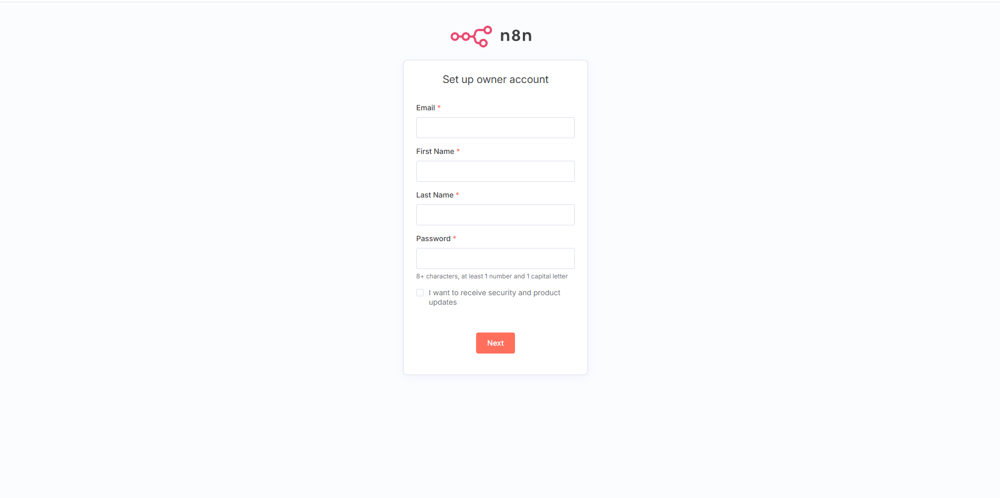
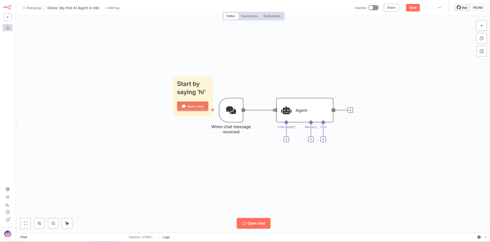
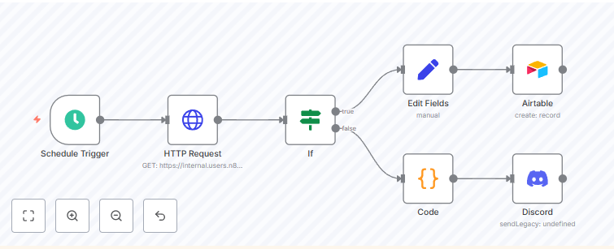

# 🚀 Deploy n8n Workflow Automation on AWS EKS - Production Ready in Any Region

[](https://opensource.org/licenses/MIT)
[](https://aws.amazon.com/eks/)
[](https://n8n.io/)
[](https://www.postgresql.org/)

**One-click deployment of n8n workflow automation platform on Amazon EKS with enterprise-grade security, multi-region support, and production-ready configuration. Perfect for DevOps teams looking to automate workflows at scale.**

## Architecture Overview

Deploying n8n on Amazon EKS provides scalability, automation, and high reliability for enterprise workflow operations.

### Overall Architecture

**Amazon EKS**: Container orchestration platform that manages and scales n8n applications with high availability and security.

**Amazon EC2 (Worker Nodes)**: Runs n8n and PostgreSQL pods in isolated environments with dedicated compute resources.

**PostgreSQL**: Stores workflow data, credentials, and execution history with persistent storage and backup capabilities.

**AWS Load Balancer Controller**: Provides secure n8n access endpoints via HTTPS/TLS with automatic SSL termination.

**Amazon CloudWatch**: Collects logs and metrics for comprehensive monitoring, alerting, and performance optimization.

**Amazon S3 (Optional)**: Stores automated backups and workflow exports for disaster recovery and compliance.

### Operational Flow

```
Internet → AWS NLB → EKS Service → n8n Pod → PostgreSQL Pod
                                      ↓
                              CloudWatch Logs/Metrics
                                      ↓
                              S3 Backup (Optional)
```

1. **User Access**: Users access n8n interface through Load Balancer URL or custom domain with SSL/TLS encryption.

2. **Request Processing**: Requests are routed to n8n application pods within the dedicated n8n namespace.

3. **Data Persistence**: Workflow runtime interacts with PostgreSQL for data storage and retrieval operations.

4. **Monitoring**: All metrics and logs are exported to CloudWatch for real-time monitoring and optimization.

5. **Backup Operations**: Automated CronJob backups send data to S3 for disaster recovery (when configured).

### Architecture Benefits

**Multi-Region Ready**: Easy expansion across multiple AWS regions with consistent deployment patterns.

**Security by Design**: NetworkPolicy isolation, HTTPS encryption, and separate IAM roles for enhanced security.

**Observability**: Integrated metrics, logs, and events with CloudWatch for comprehensive monitoring.

**Scalability**: Supports horizontal pod autoscaling based on CPU/memory load with automatic resource management.

**High Availability**: Multi-AZ deployment with pod anti-affinity for fault tolerance and zero-downtime operations.

**Cost Optimization**: Resource quotas and limits prevent over-provisioning while maintaining performance.

## What is n8n?

**n8n** (pronounced "n-eight-n") is a powerful, open-source workflow automation tool that enables you to connect different services and automate repetitive tasks without writing code. It's designed for technical and non-technical users alike.

### Key Features

- **Visual Workflow Builder**: Drag-and-drop interface for creating complex automation workflows
- **400+ Integrations**: Pre-built nodes for popular services (Slack, Gmail, AWS, GitHub, etc.)
- **Code Flexibility**: Execute custom JavaScript, Python, or shell commands when needed
- **Self-Hosted**: Full control over your data and workflows
- **API-First**: RESTful API for programmatic workflow management
- **Conditional Logic**: Advanced branching, loops, and error handling
- **Scheduling**: Time-based triggers and cron job support
- **Webhook Support**: HTTP endpoints for external service integration

### Use Cases

- **Data Synchronization**: Sync data between CRM, databases, and spreadsheets
- **Notification Systems**: Automated alerts via email, Slack, or SMS
- **Content Management**: Automated social media posting and content distribution
- **DevOps Automation**: CI/CD pipeline triggers and deployment notifications
- **E-commerce**: Order processing, inventory management, and customer communications
- **Marketing Automation**: Lead nurturing, email campaigns, and analytics reporting

## Project Structure

```
n8n/
├── infrastructure/
│   └── cluster-config.yaml      # EKS cluster configuration template
├── manifests/                   # Kubernetes manifests
│   ├── 00-namespace.yaml        # Namespace & resource quotas
│   ├── 01-postgres-secret.yaml  # Database credentials
│   ├── 03-postgres-deployment.yaml
│   ├── 04-postgres-service.yaml
│   ├── 06-n8n-deployment.yaml
│   └── 07-n8n-service.yaml
├── scripts/
│   ├── deploy.sh               # Multi-region deployment
│   ├── monitor.sh              # Status monitoring
│   └── cleanup.sh              # Resource cleanup
├── images/
│   ├── n8n-setup.png          # Setup interface screenshot
│   ├── n8n-workflow.png       # Workflow builder interface
│   └── n8n-workflow-example.png # Advanced workflow example
├── LICENSE                     # MIT License
└── README.md
```

## Quick Start

### Prerequisites

Before deploying n8n on EKS, ensure you have:

- **AWS CLI** configured with appropriate profile and permissions
- **kubectl** installed (v1.28+)
- **eksctl** installed (v0.150+)
- **Minimum AWS Permissions**:
  - EKS cluster creation and management
  - EC2 instance management
  - VPC and networking resources
  - IAM role creation
  - CloudFormation stack management

### 1. Deploy to Any Region

```bash
# Clone this repository
git clone <repository-url>
cd n8n

# Deploy to default region (us-east-1)
./scripts/deploy.sh

# Deploy to specific region
REGION=us-west-2 ./scripts/deploy.sh

# Deploy with custom cluster name and region
CLUSTER_NAME=my-n8n-cluster REGION=eu-west-1 ./scripts/deploy.sh

# Deploy with custom AWS profile
AWS_PROFILE=myprofile REGION=ap-southeast-1 ./scripts/deploy.sh

# All parameters together
CLUSTER_NAME=production-n8n REGION=us-west-2 AWS_PROFILE=devops ./scripts/deploy.sh
```

### 2. Monitor Deployment Status

```bash
# Check deployment progress
./scripts/monitor.sh

# Manual status check
kubectl get pods -n n8n
kubectl get services -n n8n
```

### 3. Access n8n

```bash
# Get LoadBalancer URL
kubectl get service n8n-service-simple -n n8n
```



*n8n owner account setup interface - Configure your admin credentials to get started*

## Regional Deployment Examples

### North America
```bash
# US East (Virginia)
REGION=us-east-1 ./scripts/deploy.sh

# US West (Oregon)
REGION=us-west-2 ./scripts/deploy.sh

# Canada (Central)
REGION=ca-central-1 ./scripts/deploy.sh
```

### Europe
```bash
# Europe (Ireland)
REGION=eu-west-1 ./scripts/deploy.sh

# Europe (Frankfurt)
REGION=eu-central-1 ./scripts/deploy.sh

# Europe (London)
REGION=eu-west-2 ./scripts/deploy.sh
```

### Asia Pacific
```bash
# Asia Pacific (Tokyo)
REGION=ap-northeast-1 ./scripts/deploy.sh

# Asia Pacific (Singapore)
REGION=ap-southeast-1 ./scripts/deploy.sh

# Asia Pacific (Sydney)
REGION=ap-southeast-2 ./scripts/deploy.sh
```

## Initial Setup & Configuration

### Step 1: Owner Account Setup

When you first access n8n, you'll be prompted to create an owner account:

1. **Email**: Your admin email address
2. **First Name**: Your first name
3. **Last Name**: Your last name  
4. **Password**: Strong password (8+ characters, 1 number, 1 capital letter)

### Step 2: Workspace Configuration

After account creation, configure your workspace:

1. **Workspace Name**: Choose a descriptive name for your organization
2. **Usage Plan**: Select based on your automation needs
3. **Team Setup**: Invite team members (optional)

### Step 3: First Workflow

Create your first automation workflow:

1. Click **"Create new workflow"**
2. Add a **Trigger Node** (Manual, Webhook, Schedule, etc.)
3. Add **Action Nodes** (HTTP Request, Email, Database, etc.)
4. **Connect nodes** by dragging between connection points
5. **Configure each node** with required parameters
6. **Test workflow** using the "Execute Workflow" button
7. **Save and activate** your workflow



*n8n workflow builder interface - Visual drag-and-drop workflow creation with multiple nodes and connections*

### Advanced Workflow Example



*Example of a more complex n8n workflow with multiple integrations, conditional logic, and data processing nodes*

### Step 4: Security Configuration

Enhance security for production use:

```bash
# Enable HTTPS (recommended for production)
kubectl patch deployment n8n-simple -n n8n -p '{"spec":{"template":{"spec":{"containers":[{"name":"n8n","env":[{"name":"N8N_SECURE_COOKIE","value":"true"},{"name":"N8N_PROTOCOL","value":"https"}]}]}}}}'

# Set up custom domain (requires certificate)
# Update service to use custom domain and TLS
```

## Configuration

### Database Configuration
- **Host**: postgres-service-simple.n8n.svc.cluster.local
- **Database**: n8n
- **User**: n8nuser
- **Password**: n8n-secure-password-2024
- **Port**: 5432

### Resource Allocation

| Component | CPU Request | CPU Limit | Memory Request | Memory Limit | Storage |
|-----------|-------------|-----------|----------------|--------------|---------|
| PostgreSQL | 250m | 500m | 256Mi | 512Mi | 20Gi (emptyDir) |
| n8n | 250m | 1000m | 512Mi | 1Gi | 10Gi (emptyDir) |

### Environment Variables

| Variable | Value | Description |
|----------|-------|-------------|
| `N8N_SECURE_COOKIE` | false | Cookie security (set to true for HTTPS) |
| `N8N_PROTOCOL` | http | Protocol (change to https for production) |
| `N8N_PORT` | 5678 | Application port |
| `N8N_METRICS` | true | Enable Prometheus metrics |
| `DB_TYPE` | postgresdb | Database type |
| `DB_POSTGRESDB_HOST` | postgres-service-simple.n8n.svc.cluster.local | Database host |
| `DB_POSTGRESDB_DATABASE` | n8n | Database name |

## Management Commands

### Cluster Operations

```bash
# Check cluster status
kubectl cluster-info
kubectl get nodes

# Check n8n namespace resources
kubectl get all -n n8n

# View resource usage
kubectl top pods -n n8n
kubectl top nodes
```

### Application Management

```bash
# View application logs
kubectl logs -f deployment/n8n-simple -n n8n
kubectl logs -f deployment/postgres-simple -n n8n

# Scale application
kubectl scale deployment n8n-simple --replicas=3 -n n8n

# Update n8n version
kubectl set image deployment/n8n-simple n8n=n8nio/n8n:1.0.0 -n n8n

# Restart deployment
kubectl rollout restart deployment/n8n-simple -n n8n
```

### Database Operations

```bash
# Connect to PostgreSQL
kubectl exec -it deployment/postgres-simple -n n8n -- psql -U n8nuser -d n8n

# Backup database
kubectl exec deployment/postgres-simple -n n8n -- pg_dump -U n8nuser n8n > n8n-backup-$(date +%Y%m%d).sql

# Restore database
kubectl exec -i deployment/postgres-simple -n n8n -- psql -U n8nuser -d n8n < n8n-backup.sql
```

## Security & Best Practices

### Production Security Checklist

- [ ] Enable HTTPS/TLS with valid certificates
- [ ] Use strong, unique passwords for all accounts
- [ ] Implement network policies for pod-to-pod communication
- [ ] Enable audit logging for compliance
- [ ] Regular security updates and patches
- [ ] Backup strategy implementation
- [ ] Monitor resource usage and set alerts

### Network Security

```bash
# Apply network policies (example)
kubectl apply -f - <<EOF
apiVersion: networking.k8s.io/v1
kind: NetworkPolicy
metadata:
  name: n8n-network-policy
  namespace: n8n
spec:
  podSelector:
    matchLabels:
      app: n8n-simple
  policyTypes:
  - Ingress
  - Egress
  ingress:
  - from: []
    ports:
    - protocol: TCP
      port: 5678
EOF
```

## Monitoring & Observability

### Health Checks

The deployment includes comprehensive health monitoring:

- **Liveness Probe**: HTTP GET `/healthz` every 30s
- **Readiness Probe**: HTTP GET `/healthz` every 10s
- **Startup Probe**: HTTP GET `/healthz` with 60s timeout

### Metrics Collection

```bash
# Enable metrics collection
kubectl port-forward service/n8n-service-simple 8080:80 -n n8n

# Access metrics endpoint
curl http://localhost:8080/metrics
```

### Log Aggregation

```bash
# Stream logs from all n8n pods
kubectl logs -f -l app=n8n-simple -n n8n

# Export logs to file
kubectl logs deployment/n8n-simple -n n8n > n8n-logs-$(date +%Y%m%d).log
```

## Troubleshooting

### Common Issues

#### Pods Not Starting
```bash
# Check pod status and events
kubectl describe pod <pod-name> -n n8n
kubectl get events -n n8n --sort-by='.lastTimestamp'

# Check resource constraints
kubectl describe resourcequota n8n-quota -n n8n
```

#### Database Connection Issues
```bash
# Test database connectivity
kubectl exec -it deployment/n8n-simple -n n8n -- nc -zv postgres-service-simple 5432

# Check database logs
kubectl logs deployment/postgres-simple -n n8n --tail=50
```

#### LoadBalancer Issues
```bash
# Check service status
kubectl describe service n8n-service-simple -n n8n

# Check AWS Load Balancer Controller
kubectl get pods -n kube-system | grep aws-load-balancer
```

### Performance Optimization

```bash
# Increase resources for high workload
kubectl patch deployment n8n-simple -n n8n -p '{"spec":{"template":{"spec":{"containers":[{"name":"n8n","resources":{"requests":{"cpu":"500m","memory":"1Gi"},"limits":{"cpu":"2000m","memory":"2Gi"}}}]}}}}'

# Enable horizontal pod autoscaling
kubectl autoscale deployment n8n-simple --cpu-percent=70 --min=2 --max=10 -n n8n
```

## Cleanup

### Remove n8n Application Only
```bash
kubectl delete namespace n8n
```

### Complete Infrastructure Cleanup
```bash
./scripts/cleanup.sh
```

### Manual Cleanup
```bash
# Delete EKS cluster (replace with your region and cluster name)
eksctl delete cluster --region=$REGION --name=$CLUSTER_NAME --profile=$AWS_PROFILE

# Clean up any remaining resources
aws cloudformation list-stacks --region=$REGION --profile=$AWS_PROFILE
```

## Backup & Recovery

### Automated Backup Strategy

```bash
# Create backup CronJob
kubectl apply -f - <<EOF
apiVersion: batch/v1
kind: CronJob
metadata:
  name: n8n-backup
  namespace: n8n
spec:
  schedule: "0 2 * * *"  # Daily at 2 AM
  jobTemplate:
    spec:
      template:
        spec:
          containers:
          - name: backup
            image: postgres:15-alpine
            command:
            - /bin/bash
            - -c
            - |
              pg_dump -h postgres-service-simple -U n8nuser n8n > /backup/n8n-\$(date +%Y%m%d-%H%M%S).sql
              # Upload to S3 (optional)
              # aws s3 cp /backup/n8n-\$(date +%Y%m%d-%H%M%S).sql s3://your-backup-bucket/
            env:
            - name: PGPASSWORD
              valueFrom:
                secretKeyRef:
                  name: postgres-secret
                  key: password
            volumeMounts:
            - name: backup-storage
              mountPath: /backup
          volumes:
          - name: backup-storage
            emptyDir: {}
          restartPolicy: OnFailure
EOF
```

## Production Considerations

### Scaling Recommendations

- **Horizontal Scaling**: Use HPA for automatic pod scaling based on CPU/memory
- **Vertical Scaling**: Increase resource limits for CPU-intensive workflows
- **Database Scaling**: Consider managed RDS PostgreSQL for production workloads
- **Storage**: Implement persistent volumes with EBS for data durability

### High Availability Setup

```bash
# Multi-AZ deployment with pod anti-affinity
kubectl patch deployment n8n-simple -n n8n -p '{"spec":{"template":{"spec":{"affinity":{"podAntiAffinity":{"preferredDuringSchedulingIgnoredDuringExecution":[{"weight":100,"podAffinityTerm":{"labelSelector":{"matchExpressions":[{"key":"app","operator":"In","values":["n8n-simple"]}]},"topologyKey":"kubernetes.io/hostname"}}]}}}}}}'
```

## Useful Resources

### Documentation
- [n8n Official Documentation](https://docs.n8n.io/)
- [n8n Community Forum](https://community.n8n.io/)
- [AWS EKS Documentation](https://docs.aws.amazon.com/eks/)
- [Kubernetes Documentation](https://kubernetes.io/docs/)

### n8n Learning Resources
- [n8n Workflow Templates](https://n8n.io/workflows/)
- [n8n YouTube Channel](https://www.youtube.com/c/n8n-io)
- [n8n Blog](https://blog.n8n.io/)

### AWS Resources
- [EKS Best Practices Guide](https://aws.github.io/aws-eks-best-practices/)
- [AWS Load Balancer Controller](https://kubernetes-sigs.github.io/aws-load-balancer-controller/)

## Contributing

1. Fork the repository
2. Create a feature branch (`git checkout -b feature/amazing-feature`)
3. Commit your changes (`git commit -m 'Add some amazing feature'`)
4. Push to the branch (`git push origin feature/amazing-feature`)
5. Open a Pull Request

## License

This project is licensed under the MIT License - see the [LICENSE](LICENSE) file for details.

## Version Information

- **n8n Version**: Latest (automatically updated)
- **PostgreSQL Version**: 15
- **Kubernetes Version**: 1.32
- **EKS Platform Version**: Latest
- **Last Updated**: October 2025

---

**Deployment Type**: Kubernetes Native  
**License**: MIT License  
**Multi-Region Support**: All AWS Regions
